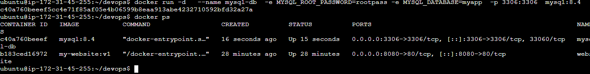
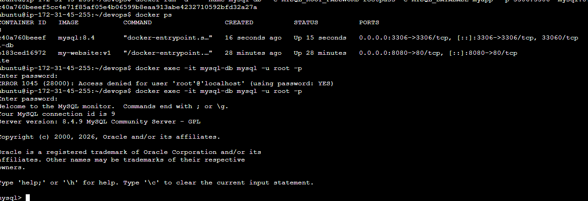
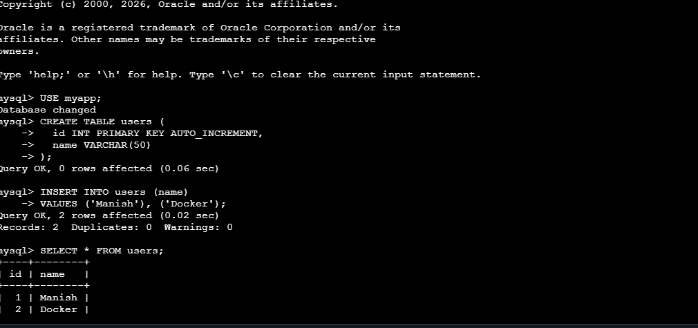
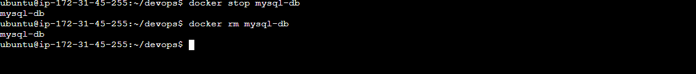
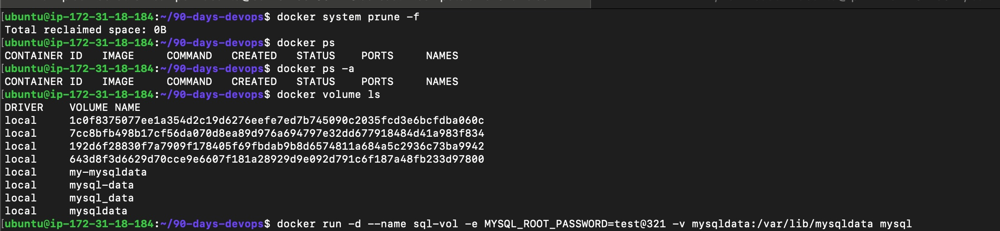
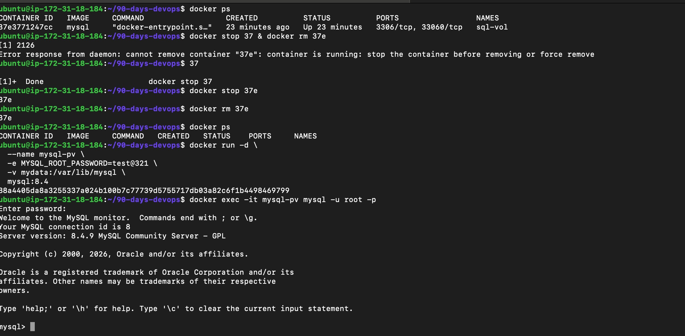
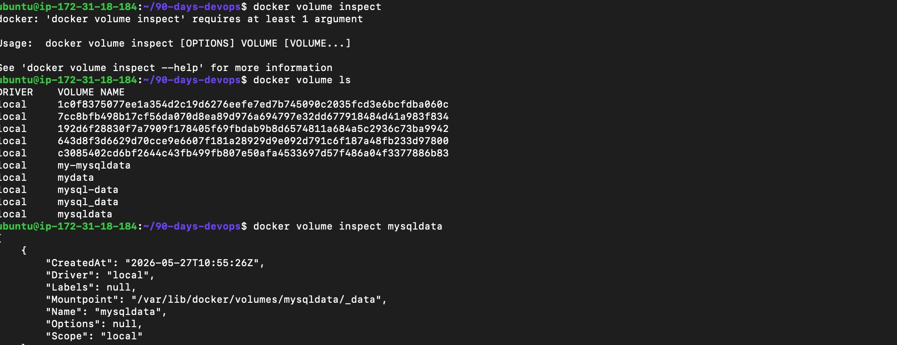

# Day 32 – Docker Volumes & Networking

## Challenge Tasks

### Task 1: The Problem
1. Run a Postgres or MySQL container
    
    

2. Create some data inside it (a table, a few rows — anything)

    

3. Stop and remove the container

    

4. Run a new one — is your data still there?

    

    - No, Data is lost when a container is removed because containers are ephemeral and do not persist data by default.

---

### Task 2: Named Volumes
1. Create a named volume

    

2. Run the same database container, but this time **attach the volume** to it

   

3. Add some data, stop and remove the container

4. Run a brand new container with the **same volume**

    

5. Is the data still there?
    - Yes,all previous data ,tables and rows are still there.

    Verify: `docker volume ls`, `docker volume inspect`

    

---

---
